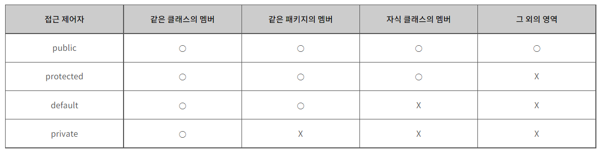

## 접근 제어자 (private, protected, default, public)

- 접근 제어자의 접근 범위
- 접근 범위가 넓은 순: public > protected > default > private
- default랑 package-private은 같은 겁니다.



### 🤫 Private
        
- 선언된 클래스에서만 접근 가능하다.
        
```java
  public class SameClass {
      **private** String var = "같은 클래스만 허용"; // private 필드
      **private** String getVar() {                  // private 메소드
          return this.var;
      }
  }
```
        
### 📢 Public

- 내외부 어디서든 접근 가능하다.

```java
  public class EveryWhere {
      public String var = "누구든지 허용"; // public 필드
      public String getVar() {             // public 메소드
          return this.var;
      }
  }
```

### 🍰 Default (= package-private)

- 같은 패키지에 포함된 경우와 선언된 클래스 내에서 접근 가능하다.


- 접근 제어자를 선언하지 않으면 default가 된다.

```java
public class SamePackage {
    String var = "같은 패키지는 접근 가능"; // default 필드

    public static void main(String[] args) {
        SamePackage sp = new SamePackage();
        System.out.println(sp.sameVar);     // 같은 패키지는 허용
    }
}
```

### 🥽 Protected

- **같은 패키지에 속하는 클래스**와 **상속받은 자식 클래스**에서만 접근 가능하다


```java
package EffectiveJava.item15.packageA;

public class Protected {

    protected String var = "같은 패키지 Ok, 다른 패키지에 속하는 자식 클래스까지 허용";

}
```

- 다른 패키지라도 상속 받으면 protected에 접근 가능하다.

```java
package EffectiveJava.item15.packageB; // 다른 패키지

public class ExtendsProtected extends Protected {

    public static void main(String[] args) {
        ExtendsProtected extendsProtected = new ExtendsProtected();

        System.out.println(extendsProtected.var); // 상속받은 클래스에서 protected 접근 가능
    }
```

**클래스도 접근 제어자를 사용하면 동일하게 동작합니다.**


