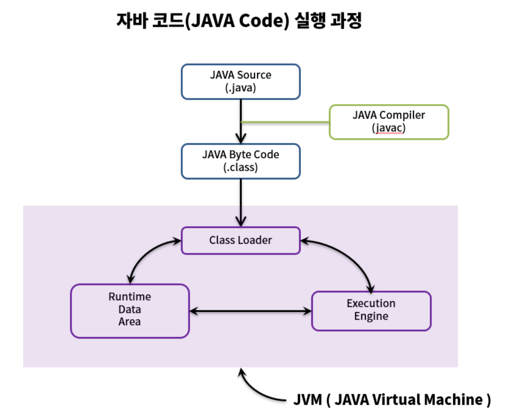

# 📃 25. 톱 레벨 클래스는 한 파일에 하나만 담아라

## 📌 소스 파일 하나에 여러 클래스 선언

---

- 소스 파일 하나에 톱레벨 클래스를 여러 개 선언하더라도 자바 컴파일러는 불평하지 않는다.
- 다만, **아무런 득이 없을 뿐더러 심각한 위험을 감수해야 하는 행위다.**
    - 한 클래스를 여러 가지로 정의할 수 있으며, 그중 어느 것을 사용할지는 어느 소스 파일을 먼저 컴파일하냐에 따라 달라지기 때문

## ❗문제 상황

---

- 아래 소스 파일은 `Main`클래스 하나를 담고 있고, 다른 톱레벨 클래스는 다른 톱레벨 클래스 2개(`Utensil`과 `Dessert`)를 참조한다.

    ```java
    public class Main {
        public static void main(String[] args) {
            System.out.println(Utensi.NAME + Dessert.NAME);
        }
    }
    ```

    - 집기 (`Utensil`)와 디저트(`Dessert`) 클래스가 `Utensil.java` 라는 한 파일에 정의 되어 있다고 해보자

        ```java
        class Utemsil {
            static final String NAME = "pan";
        }
        
        class Dessert {
            static final String NAME = "cake";
        }
        ```

    - 물론 `Main`을 실행하면"pancake"를 출력함

- ⚠️ 만약 우연히 똑같은 두 클래스를 담은 `Dessert.java`라는 파일을 만들었다고 해보자.

    ```java
    class Utemsil {
        static final String NAME = "pot";
    }
    
    class Dessert {
        static final String NAME = "pie";
    }
    ```

- `javac Main.java Dessert.java` 명령으로 컴파일한다면 컴파일 오류가 나면서 `Utensil`과 `Dessert` 클래스를 중복 정의했다고 알려줄 것이다.
    - 컴파일러는 먼저 `Main.java`를 컴파일 하고 그 안에서(`Dessert` 참조보다 먼저 나오는) `Utensil`참조를 만나면 `Untensil.java` 파일을 살펴 `Utensil`과 `Dessert`를 모두 찾아낼 것임
    - 후 컴파일러가 두 번째 명령줄 인수인 `Dessert.java`를 처리하여 할 때 같은 클래스가 이미 있음을 알게 됨
- 컴파일러에 **어떤 소스를 먼저 건네느냐에 따라 동작이 달라지는 문제**가 생긴다.
    - `javac Main.java`나 `javac Main.java Utensil.java` 명령으로 실행하면 의도한 `pancake`를 출력함
    - 그러나 `javac Dessert.java Main.java` 명령으로 컴파일 하면 `potpie`를 출력함
- 명령어 참고) command 창에서 컴파일 후 실행
    - 컴파일 : `javac fileName.java class.java`
    - 실행: `java fileName`

## 해결책

---

- 단순히 톱레벨 클래스들(`Utensil`과 `Dessert`)을 **서로 다른 소스 파일로 분리하면 그만**이다.
- 굳이 여러 톱레벨 클래스를 한 파일에 담고 싶다면 **정적 멤버 클래스**(규칙 24)를 사용하는 방법을 고민해볼 수 있다.
    - 다른 클래스에 딸린 부차적인 클래스라면 정적 멤버 클래스로 만드는 쪽이 일반적으로 더 나을 것임
    - 읽기 좋고, `private`으로 선언하면 (규칙 15)접근 범위도 최소로 관리할 수 있기 때문
- 위 예제를 정적 멤버 클래스로 바꿔본 예제

    ```java
    public class Main {public static void main(String[] args) {
            System.out.println(Utensi.NAME + Dessert.NAME);
        }
    
        private static class Utensil {static final String NAME = "pan";
        }
    
        private static class Dessert {static final String NAME = "cake";
        }
    }
    ```


## 결론

---

- **소스 파일 하나에는 반드시 톱레벨 클래스(혹인 톱레벨 인터페이스)를 하나만 담자.**
    - 이 규칙만 따른다면 컴파일러가 한 클래스에 대한 정의를 여러 개 만들어 내는 일은 사라짐

- **자바 컴파일 순서**

  
    
  ---

    1. 개발자가 자바 소스코드(.java)를 작성합니다.
    2. 자바 컴파일러(Java Compiler)가 JVM용 바이트 코드로 자바 소스파일을 컴파일합니다.
        - 이때 나오는 파일은 자바 바이트 코드(.class)파일로 아직 컴퓨터가 읽을 수 없는 자바 가상 머신이 이해할 수 있는 코드입니다. 바이트 코드의 각 명령어는 1바이트 크기의 Opcode와 추가 피연산자로 이루어져 있습니다.
    3. 컴파일된 바이크 코드를 JVM의 클래스로더(Class Loader)에게 전달합니다.
    4. 클래스 로더는 동적로딩(Dynamic Loading)을 통해 필요한 클래스들을 로딩 및 링크하여 런타임 데이터 영역(Runtime Data area), 즉 JVM의 메모리에 올립니다.
        - **클래스 로더 세부 동작**
            1. **로드** : 클래스 파일을 가져와서 JVM의 메모리에 로드합니다.
            2. **검증** : 자바 언어 명세(Java Language Specification) 및 JVM 명세에 명시된 대로 구성되어 있는지 검사합니다.
            3. **준비** : 클래스가 필요로 하는 메모리를 할당합니다. (필드, 메서드, 인터페이스 등등)
            4. **분석** : 클래스의 상수 풀 내 모든 심볼릭 레퍼런스를 다이렉트 레퍼런스로 변경합니다.
            5. **초기화** : 클래스 변수들을 적절한 값으로 초기화합니다. (static 필드)
    5. 실행엔진(Execution Engine)은 JVM 메모리에 올라온 바이트 코드들을 명령어 단위로 하나씩 가져와서 실행합니다. 이때, 실행 엔진은 두가지 방식으로 변경합니다.
        1. 인터프리터 : 바이트 코드 명령어를 하나씩 읽어서 해석하고 실행합니다. 하나하나의 실행은 빠르나, 전체적인 실행 속도가 느리다는 단점을 가집니다.
        2. JIT 컴파일러(Just-In-Time Compiler) : 인터프리터의 단점을 보완하기 위해 도입된 방식으로 바이트 코드 전체를 컴파일하여 바이너리 코드로 변경하고 이후에는 해당 메서드를 더이상 인터프리팅 하지 않고, 바이너리 코드로 직접 실행하는 방식입니다. 하나씩 인터프리팅하여 실행하는 것이 아니라 바이트 코드 전체가 컴파일된 바이너리 코드를 실행하는 것이기 때문에 전체적인 실행속도는 인터프리팅 방식보다 빠릅니다.